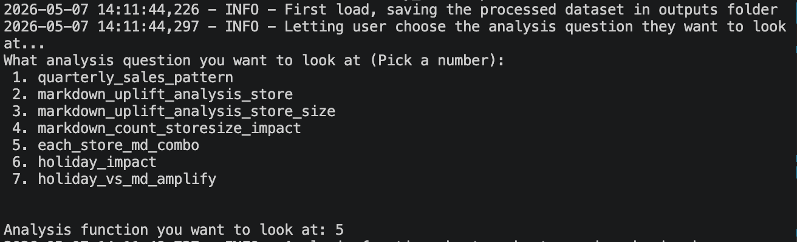

# Walmart Sales ETL Pipeline
### Investigating the relationship between promotions, holidays, and sales performance

 

## Project Overview

This project builds a mini end-to-end ETL pipeline to analyse how holiday periods and promotional markdowns influence weekly sales performance across 45 Walmart stores. Rather than relying on ad-hoc exploration, the pipeline is structured as a reusable system, from raw data ingestion through to cleaned outputs and business insights.

The analysis questions a common retail assumption: that more promotional activity directly drives higher sales.

 

## Repository Structure

WALMART ETL/
├── etl/                        # Core pipeline modules
│   ├── extract.py              # Data ingestion (CSVs)
│   ├── transform.py            # Cleaning & feature engineering
│   ├── load.py                 # Export logic to outputs/
│   └── __init__.py
├── utils/                      # Shared helpers
│   ├── config.py               # File paths & settings
│   ├── logging_set_up.py       # Log formatting
│   └── __init__.py
├── raw_data/                   # Input CSV files
│   ├── features.csv
│   ├── sales.csv
│   └── store.csv
├── outputs/                    # Processed results & charts
├── logs/                       # Execution history
│   └── pipeline.log
├── docs/                       # Project documentation
│   ├── README.md
│   └── notebook.ipynb
├── .gitignore                  # Skips __pycache__ and logs
└── main.py                     # Entry point to run pipeline


## Dataset

Three source files from the [Walmart Store Sales dataset](https://www.kaggle.com/datasets/yasserh/walmart-dataset):

| File | Description | Rows |
|------|-------------|------|
| `sales.csv` | Weekly sales by store and department | 421,570 |
| `stores.csv` | Store type and size metadata | 45 |
| `features.csv` | Holiday flags, markdowns, and economic indicators | 8,190 |

---

## Pipeline Architecture

```
Raw CSVs → Extract → Transform → Load → Analyze → Visualise
```

**Extract** — Loads all three source files with type-safe date parsing and row-level logging.

**Transform** — Merges tables on store and date, corrects data quality issues, and engineers analytical features:
- Negative markdown values, if falling into the acceptable range given by users, default to 5% of the whole dataset, will corrected to zero (flagged as warnings in logs)
- Sales across departments will be aggregated to store-week level
- Holiday flag, markdown flag, and markdown percentage columns will be added
- Median used as primary sales metric due to store-level outliers

**Load** — Generalised output function accepts any analysis function as input, executes it, and saves the result as a labelled CSV, keeping analysis and persistence cleanly separated.

**Analyze** — Each business question is an independent function returning a structured result. Questions are modular and can be run individually or as a full suite.

**Logging** — Pipeline execution is tracked end-to-end with timestamped INFO and WARNING level logs written to `logs/pipeline.log` on every run.


## Key Findings

#### Markdown Impact on Sales
- Markdown did not consistently produce positive sales uplift compared to no-markdown periods across all stores (observation counts were sufficiently large, 50+ per group, to meet the Central Limit Theorem and reduce extreme skew)
- No clear relationship found between store size and markdown-driven sales uplift, the largest store showed the lowest uplift, while the smallest showed the second highest; the remaining sizes followed no discernible pattern

#### Holiday Impact on Sales
- Holidays showed a positive impact on sales, and this effect was stronger than markdown's impact when each factor was assessed independently
- Markdown did amplify holiday-period sales, but holidays remained the dominant driver

#### Quarterly Sales Patterns
- Q1 and Q2 results varied across stores with no consistent winner between the two
The pattern in which Q3 consistently dipped from Q2 across all stores was seen in all years recorded
- Q4 saw a strong rebound across all stores, likely driven by the high concentration of public holidays in that period

#### Store Size & Sales
- Larger stores generally recorded higher absolute sales than smaller stores
Holiday uplift was also greater for larger stores, though the difference was not dramatic, the most notable gap between non-holiday and holiday was among the smallest store  

#### Markdown Combination Analysis
- Bundling more markdown types did not guarantee higher sales regardless of store size
Larger stores in general received more markdown combinations (more types applied simultaneously)
- Across store sizes, stores with the full combination of all 5 markdowns tended to perform best overall
However, a 4-markdown combo did not consistently outperform a 3-markdown combo, which was an unexpected finding
- The smallest store bucked the general trend, its highest sales were recorded under 2- or 3-markdown combinations; investigation revealed the MD3 + MD5 combo produced notably strong results, appearing in the two second-highest sales spots for that size tier
- Larger stores rarely had 2- or 3-markdown combinations, making direct comparison unreliable for those tiers
- MD5 alone ranked last in sales performance, suggesting it works best when paired with other markdown types, particularly MD3

 

## Technical Stack used

| Tool | Usage |
|------|-------|
| Python 3.13 | Pipeline development |
| Pandas | Data manipulation and transformation |
| Matplotlib | Trend and distribution visualisation |
| Seaborn | Statistical and comparative charts |
| Logging | Execution tracking and data quality warnings |

 
## How to Run

**1. Clone the repository**
```bash
git clone https://github.com/KhanhHa313/walmart_etl.git
cd walmart_etl
```

**2. Install dependencies**
```bash
pip install pandas matplotlib seaborn numpy 
```

**3. Add raw data files**

Place `sales.csv`, `stores.csv`, and `features.csv` into `data/raw/`.

**4. Run the pipeline**
```bash
python main.py
```
*A bit about the main.py:*
When prompted, you can select an analysis question by number. The pipeline will save the corresponding CSV and chart to the outputs folder automatically. Outputs will be saved to `outputs/` and logs written to `logs/pipeline.log`



## Design Decisions

**Why median over mean for sales?**
Department-level sales data contains significant outliers that skew store-level aggregations. Median provides a more stable central measure for cross-store comparison.

**Why crop features to the sales date range?**
The features table spans a wider date range than sales records. Since weekly sales is the primary metric, the analysis is scoped to dates where sales data exists — avoiding sparse join artefacts.

**Why a generalised load function?**
Rather than hardcoding a save step for every analysis output, the load function will take any analysis function as an argument and handles CSV export dynamically. This keeps the pipeline extensible, new analysis questions can be added without modifying the load logic.
 

 
